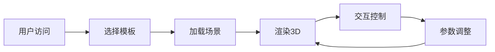

## 1. Product Overview
工业流程图 3D 可视化渲染器 - 将流程图转换为具有管线金属质感和浅蓝色背景的精美3D场景，支持交互式查看和自定义配置。
- 目标用户：工业设计师、生产工程师、系统架构师、数据可视化爱好者
- 市场价值：提供专业、美观的流程图可视化方案，提升展示效果和用户体验

## 2. Core Features

### 2.1 User Roles (if applicable)
| Role | Registration Method | Core Permissions |
|------|---------------------|------------------|
| Normal User | None (无需登录) | 使用所有可视化功能 |

### 2.2 Feature Module
1. **主页面**: 3D场景展示、控制面板、示例模板
2. **配置面板**: 材质调节、视角控制、场景设置

### 2.3 Page Details
| Page Name | Module Name | Feature description |
|-----------|-------------|---------------------|
| 主页面 | 3D场景 | 展示具有金属质感管线的流程图，支持旋转、缩放、平移 |
| 主页面 | 控制面板 | 调节视角、材质、光照效果 |
| 主页面 | 示例模板 | 提供预设的工业流程图示例 |

## 3. Core Process
用户访问页面 → 选择预设模板或加载自定义流程图 → 系统自动渲染3D场景 → 用户交互查看和调整参数

## 4. User Interface Design
### 4.1 Design Style
- **主色调**: 工业蓝 (#4A90E2)、金属银 (#B8C5D6)
- **辅助色**: 深灰 (#2C3E50)、浅蓝 (#E8F4FC)
- **背景色**: 浅蓝色渐变 (#DCEEFC 到 #AED4F1)
- **材质风格**: 管线金属质感 (PBR金属材质)
- **字体**: 现代无衬线字体，清晰易读
- **布局**: 全屏3D场景 + 悬浮控制面板
- **图标风格**: 工业风格，简洁线条图标

### 4.2 Page Design Overview
| Page Name | Module Name | UI Elements |
|-----------|-------------|-------------|
| 主页面 | 3D场景 | 全屏Canvas、动态光照、金属质感管线、节点高亮 |
| 主页面 | 控制面板 | 半透明深色面板、滑块控件、按钮组、材质预览 |
| 主页面 | 示例模板 | 底部缩略图导航、卡片式布局 |

### 4.3 Responsiveness
桌面端完整功能，平板和手机端简化控制，保持核心3D渲染能力

### 4.4 3D Scene Guidance
- **环境/氛围**: 工业风格工作室场景，HDRI环境贴图
- **光照设置**: 主方向光 + 环境光 + 补光，营造立体感
- **摄像机设置**: 初始正视图，支持轨道控制、缩放、平移
- **构图与焦点**: 中心构图，管线为主要视觉元素
- **交互与动画**: 鼠标悬停高亮、平滑动画过渡、节点脉冲效果
- **后处理效果**: 轻微辉光、环境光遮蔽、FXAA抗锯齿
- **资源来源与性能**: 使用Three.js内置几何体，加载优化，目标60fps
